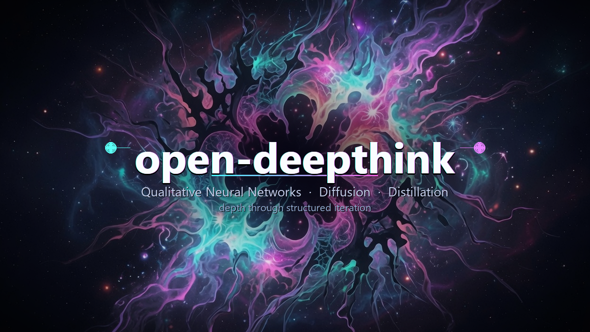

<p align="center">
  
</p>

# open-deepthink: Evolvable Agent Networks for Deep, Structured Reasoning

**Not another flat panel of 16 agents brainstorming once.**  
A **Qualitative Neural Network (QNN)** that runs layered forward passes, reflects on its own performance, mutates its agents' cognitive identities, raises the difficulty of the problem, and records the entire developmental history as high-signal training data.

Most agentic systems give you breadth through parallelism. open-deepthink gives you **depth through structured iteration and self-modification**.

### What this is (and is not)

This is a **structured multi-agent loop**: layered LLM calls, lexical retrieval of past cells, prompt rewrite between epochs, and JSON traces. Neural-net words (Mirror Descent, self-attention, diffusion) are a **design language**. They are not those algorithms. Output quality versus a single long prompt is **unevaluated**. See [`docs/DESIGN_NOTES.md`](./docs/DESIGN_NOTES.md) and [`docs/EVAL.md`](./docs/EVAL.md).

**Start small.** Auto mode caps at 24 agents. Prefer `2×2×1` or `3×3×2`. Estimate before you spend:

```bash
deepthink estimate qnn --layers 2 --width 2 --epochs 1
deepthink eval          # mock LLMs, no API key — structural checks only
```

---

## 🎰 Qualitative Diffusion (QDAD) — New Technique

**An N×N noun×verb grid: high-temp invent, critic rewrite, then one synthesizer.** Available as:

1. **App Slot Machine Mode** in this app (full LangGraph engine + logs + matrix transparency)
2. **Portable `/qdad` skill** for Grok Build and other agentic coders — no server required

| Classical diffusion | Qualitative Diffusion (QDAD) |
|---------------------|------------------------------|
| Continuous noise in latent space | **Controlled qualitative noise** at high temperature |
| Denoising network | **Critic agents** (reverse diffusion / score matching in language) |
| Pixel / embedding basis | **Nouns × verbs** as orthogonal basis directions |
| Image from a vague prompt | **Buildable agentic coding prompt** from a vague aesthetic app prompt |

**How it works**

1. **Foundation** — From your Midjourney-style intent, sample **N nouns** and **N verbs** (shared qualitative basis).
2. **Grid** — Build an **N×N** grid of FeatureAgents. Cell *(i, j)* is permanently bound to `nouns[i] × verbs[j]`.
3. **Forward diffusion** — In parallel, each agent invents one wild, imperfect feature at **noise temperature**.
4. **Reverse diffusion** — For each denoising step, CriticAgents with the *same* noun+verb signature clean, sharpen, and implementabilize the matrix.
5. **Decode** — A Synthesizer collapses the clean matrix into a structured **# App Build Prompt** you can hand to Grok-Build, Cursor, Claude Artifacts, etc.

**Philosophy (strict)**

- Language is the computational medium.
- Nouns and verbs act as orthogonal basis directions.
- High temperature = a sampling knob on the invent step.
- Critic agents rewrite the same cell (design-language: reverse diffusion / score matching).
- The whole process turns a vague aesthetic prompt into a concrete, buildable app specification. Quality versus one long prompt is unevaluated.

**Why a grid (not a flat feature list)?** Features sit on a forced tensor product of basis directions. Exploration is *systematic*. Critics cannot change the signature of a cell — they score-match *along* that noun×verb chart. Synthesis is a separate decode step, not “pick the best idea.”

| Run it… | Location |
|---------|----------|
| In-app | **App Slot Machine Mode** · `deepthink/qdad/` |
| In Grok Build / any agent | [`skills/qdad/SKILL.md`](./skills/qdad/SKILL.md) · `/qdad` · release zip `qdad-skill-*.zip` |

---

## The Core Problem with "Just Add More Agents"

Typical multi-agent setups (including many "16 expert" or "army of agents" brainstorming interfaces) work like this:

- Spawn N agents with static or lightly templated personas.
- Run them in parallel or loose conversation.
- Synthesize once (or a few turns).
- Done.

You get diversity of perspective, but the agents themselves do not become meaningfully better at the *specific* problem over time. There is no topology, no persistent specialization, no mechanism that rewires *how* the system thinks, and almost never a reusable artifact of the reasoning process.

open-deepthink treats agents like **neurons in a network** whose "weights" are rich natural-language personas, and whose learning rule is **Mirror Descent** — an LLM rewriting those prompts (not gradient descent). See [`docs/DESIGN_NOTES.md`](./docs/DESIGN_NOTES.md).

---

## What Makes a QNN Different

A QNN is a directed, layered graph of LLM agents with three repeating phases per epoch:

1. **Forward Pass** — Problem is decomposed across the topology. Layer 0 runs in parallel. Each subsequent layer receives context from the previous layer and builds deeper analysis. Information flows structurally, not just through a shared chat.

2. **Qualitative Self-Attention (brainstorm)** — Within each epoch, neurons do **not** only see graph neighbors. Each agent scores a capped pool of past / non-local neurons by **lexical overlap** (persona tokens vs past text) and injects the top-k excerpts. No MatMul, no extra LLM call. Inspired by [colony](https://github.com/iblameandrew/colony). Implementation: `deepthink/self_attention.py`.

3. **Reflection + Mirror Descent** — After synthesis, the system does not just "critique the answer." It:
   - Evaluates which agents struggled vs. succeeded on their specific sub-problems.
   - Extracts attributes and "hard requests" from current personas.
   - Uses a dense-spanner mechanism (or explicit mixing in Distillation) to **rewrite the system prompts, attributes, and skills** of agents for the next round.
   - In Knowledge Distillation mode, literally **spawns evolved child agents** that inherit context memory and replace struggling parents in the live topology.

4. **Problem Reframing** — A dedicated re-framer node looks at the current solution and formulates a *harder, more advanced version* of the problem. The network is then forced to solve the harder problem in the next epoch with its newly evolved agents.

This loop (decompose → structured forward **+ attend** → synthesize → reframe the goal → mutate the thinkers) is repeated for as many epochs as you allocate. The result is compounding depth rather than repeated breadth.

---

## Three Powerful Operating Modes

### 1. ⚗️ Knowledge Distillation Mode (The Data Engine)

The most distinctive and high-leverage mode.

- Fixed powerful topology: **1×2×2×2×2×2×1** (7 layers, 12 agents).
- 12 distinct cognitive archetypes (The Initiator, Builder, Connector, Preserver, Performer, Analyst, Diplomat, Transformer, Explorer, Architect, Visionary, Dreamer) with hand-crafted system prompts, attributes, and skills.
- **Task Master** decomposes the anchor question into 12 Socratically-linked sub-questions.
- Full forward pass with layer-to-layer context.
- **Mirror Descent** evaluates every agent-question pair. Hard agents trigger **live evolutionary replacement**: a Mixing Agent combines the struggling agent with the best resonant helper from the *current* grid. The child inherits the parent's 100k-token context memory and keeps the difficult question.
- **Seed Creator** evolves the topic set itself each epoch, generating ontologically adjacent new topics.
- Runs until your token budget is exhausted.

**Primary output**: A structured JSON dataset of every (epoch, agent, archetype, question, answer) pair, plus a complete `topology_archive.json` containing the full evolutionary history (every system prompt mutation, every inheritance, every difficulty judgment).

This is not generic chat logs. It is **structured developmental trace data** (QA pairs + topology archive). The intent is that traces like these could help train later models. That use is **unevaluated**.

### 2. 🧠 Brainstorming Mode (Full QNN Expert Panel)

A chat-first interface that runs the **same QNN deepthink algorithm** as the portable `/qnn` skill — not a flat static expert panel.

**Step-by-step each run:**

0. **Brief** — Impasse/enrich summary from prompt + attachments  
1. **Topology** — Auto (complexity → L×W×E) or Manual/Massive  
2. **Seeds** — Verbs + nouns from the problem space (related + far semantic fields), sampled into per-column word-vectors — same spanning DNA as qualitative verb/noun bases  

3. **Personas** — Input-span careers/attributes/skills from those guiding_words (layer 0 diverge; deeper layers converge/critique)  
4. **Epoch loop** — Layered forward pass **with qualitative self-attention** → epoch map → Mirror Descent → harder reframe  
5. **Solution-Space Report** — Divergent strategies with falsifiers and first probes (handoff to edit→run→debug)

#### Self-attention inside the epoch (from colony QSA)

Feed-forward edges only connect a neuron to the **previous layer**. Self-attention adds a second path: each agent scores a capped pool of **non-neighbor past neurons** (skipped earlier layers this epoch + other agents’ multi-epoch memory) and injects the top‑k as a sparse attended-value block.

| Transformer | Brainstorm QSA (`deepthink/self_attention.py`) |
|-------------|------------------------------------------------|
| Tokens | QNN neurons (`agent_{layer}_{width}`) |
| Q / K | Query persona traits vs past solution text |
| Softmax | Strength buckets `none/low/med/high` + distance `near/mid/far` |
| V | Excerpt + rationale injected into the agent prompt |
| Attention matrix | `state["attention_edges"]` (per-agent edge lists) |

Logs: `LOG: [QNN ATTEND] agent_L_W self-attention → k non-local past neuron(s): …`

- **Auto mode**: Complexity estimator recommends a small topology; hard cap **24 agents**.
- **Manual mode**: You set L×W. CLI refuses runs estimated at >80 LLM calls unless `--yes` (or `--debug`).
- Intermediate epochs produce compact **epoch maps**; the final epoch polishes the full report.
- Rich markdown chat interface for the report and logs for each QNN step.

Use this when you want deeper insight than a single model or a flat expert panel can deliver.

### 3. 🎰 App Slot Machine Mode (Qualitative Diffusion App Designer)

Replaces Algorithm Design Mode with **Qualitative Diffusion App Designer (QDAD)** — diffusion re-implemented at a purely qualitative scale.

**Philosophy:** language = computational medium · nouns/verbs = orthogonal basis · high T = controlled noise · critics = reverse diffusion / score matching · vague prompt → buildable app spec (Midjourney for apps).

| Layer | Path |
|-------|------|
| Package | `deepthink/qdad/` (`state`, `nodes`, `graph`, `pipeline`, `utils`) |
| Chains | `deepthink/chains/qdad_chains.py` |
| GUI | Same chat shell as Brainstorming + N / Temperature Scale / Denoising Steps / Noun-Verb T |
| Graph | LangGraph: `foundation → grid → noise → denoise⟲ → synthesize` |

- **Phase 0** — N nouns + N verbs (shared qualitative basis, noun/verb temperature)
- **Phase 1** — N×N FeatureAgents permanently bound to `nouns[i] × verbs[j]`
- **Phase 2** — Parallel forward diffusion (noise temperature)
- **Phase 3** — Iterative reverse diffusion via CriticAgents (same signature)
- **Phase 4** — Synthesizer → structured **agentic coding prompt** + transparent matrix

Feed a Midjourney-style app prompt; hand the result to Grok-Build, Cursor, Claude Artifacts, etc.

---

## The Outputs That Actually Matter

A single deep open-deepthink run produces far more than an answer:

- **Evolved QNN artifacts** — Portable, versionable "trained" multi-agent systems you can share and reuse.
- **Full evolutionary traces** — Every prompt before/after Mirror Descent, every difficulty classification, every child/parent relationship, every reframed problem.
- **Structured distillation datasets** — Purpose-built for fine-tuning or synthetic data pipelines targeting advanced reasoning and multi-agent behavior.
- **Interpretable intermediate state** — Because everything is explicit natural-language personas and traceable sub-problems, you can diagnose *why* the system thought what it thought at any layer and epoch.
- **Accumulated executable knowledge** (in code modes) — Real modules that survived sandbox validation and were re-used.

These artifacts are the real product. The final synthesized answer is a byproduct.

---

## Why This Matters for Agentic Coding and Reasoning Research

- **Test-time compute, done right and observably.** Many frontier systems hide their long reasoning inside a single model. open-deepthink makes the structure, specialization, and adaptation explicit and archivable.
- **Traces, not proven training data.** Distillation writes QA pairs and topology archives. Whether those traces improve a base model is unevaluated.
- **Reusable specialized reasoners.** An exported QNN stores evolved personas and structure. That is a different artifact from a single system prompt; we do not claim it is a better reasoner.
- **Local and long-horizon by design.** Small topologies (2×2×1, 3×3×2) fit a laptop. Larger runs are an explicit, estimated cost.

---

## Technical Strengths

- Built on **LangGraph** with cyclic graphs, parallel layers, and shared library engines for the UI, CLI, and skills.
- Phase test suite + control-flow tests (`python tests/run_all.py`) with mock LLMs — no API keys. Includes a free **structural eval** (`deepthink eval`).
- Clean provider model: only OpenRouter (cloud) and LlamaCpp / llama.cpp server (local).
- Robust JSON handling, token tracking, streaming logs, RAPTOR indexing, AST+subprocess sandbox, disk-backed sessions, and a pre-run **cost estimator**.
- Real export/import of QNN state. One `GraphState` (library = web).
- Manual mode can grow large if you pass `--yes`; auto mode caps at 24 agents. Estimate first.

---

## Quick Start

### A. Python package (algorithms library)

All three modes ship as an importable package — **no web server required**.

```bash
git clone https://github.com/iblameandrew/open-deepthink
cd open-deepthink
python -m venv venv
.\venv\Scripts\activate          # Windows
# source venv/bin/activate       # macOS/Linux
pip install -e .                 # library: QNN + QDAD + distillation
cp .env.example .env             # set OPENROUTER_API_KEY (or use llamacpp)
```

```python
import asyncio
from deepthink import create_llm, run_qnn, run_qdad, DistillationGraph

async def main():
    llm = create_llm()  # OpenRouter from env, or create_llm(provider="llamacpp")

    # 1) Qualitative Neural Network → Solution-Space Report
    qnn = await run_qnn(
        llm,
        "How do we break this ownership deadlock under concurrency?",
        params={"qnn_mode": "auto", "num_epochs": 2},
    )
    print(qnn["proposed_solution"])

    # 2) Qualitative Diffusion (QDAD) → App Build Prompt
    qdad = await run_qdad(
        llm,
        "cozy night writing app, soft dark mode, offline-first",
        params={"grid_size": 3, "denoising_steps": 2},
    )
    print(qdad)

    # 3) Knowledge Distillation → evolutionary dataset + topology archive
    graph = DistillationGraph(
        llm,
        topics=["concurrency", "ownership"],
        anchor_question="Design a latch-free ownership protocol",
        token_budget=100_000,
    )
    while graph.is_running:
        if not await graph.run_epoch():
            break
    print(len(graph.distilled_data), "QA pairs →", graph.dataset_path)

asyncio.run(main())
```

**CLI (same library, no browser):**

```bash
deepthink qnn  --prompt "Break this deadlock…" --verbose
deepthink qdad --prompt "cozy night writing app" --n 3 --steps 2
deepthink qnn  --prompt "…" --debug          # mock LLM, no API key
deepthink estimate qnn --layers 2 --width 2 --epochs 1
deepthink eval                               # structural checks, mock LLMs
deepthink version
```

| Algorithm | Import | What you get |
|-----------|--------|----------------|
| **QNN** | `from deepthink import run_qnn` | Layered multi-agent epochs + Mirror Descent + self-attention → Solution-Space Report |
| **QDAD** | `from deepthink import run_qdad` | Noun×verb diffusion grid → buildable App Build Prompt |
| **Distillation** | `from deepthink import DistillationGraph` | 1×2×2×2×2×2×1 evolutionary topology → dataset + `topology_archive.json` |
| **Self-attention** | `from deepthink import compute_self_attention` | Qualitative attention over non-local past neurons |
| **Providers** | `from deepthink import create_llm` | OpenRouter or llama.cpp chat models |
| **Cost / eval** | `estimate_qnn_cost`, `run_structural_eval` | Call-count estimate; mock structural eval (not a quality bench) |

Package layout:

```
deepthink/
  api.py              # high-level run_qnn / run_qdad / run_distillation
  providers.py        # create_llm(...)
  qnn/                # brainstorm QNN pipeline
  qdad/               # qualitative diffusion
  distillation/       # evolutionary knowledge distillation
  self_attention.py   # lexical overlap “attention”
  cost.py             # LLM-call / token estimates (no network)
  eval_structural.py  # mock structural eval
  mocks.py            # CoderMockLLM / DistillationMockLLM
  sessions.py         # disk-backed session store
  rag.py              # RAPTOR index (web UI)
  runtime/            # log bus + leftover LangGraph nodes
  chains/             # all LangChain prompt factories
  config.py           # typed Settings (.env / env / TOML)
```

Full API surface: `from deepthink import …` (see `deepthink/__init__.py` and `deepthink/api.py`).

### B. Web app (optional UI)

```bash
pip install -e ".[web]"          # library + FastAPI UI
# or: pip install -r requirements.txt
open-deepthink                   # or: deepthink serve  |  python -m deepthink
# or: python app.py
```

Open http://127.0.0.1:8000.

**Supported providers**: OpenRouter (bring your own key) and LlamaCpp / llama.cpp server (local).

### Docker

```bash
cp .env.example .env   # set OPENROUTER_API_KEY
docker compose up --build
```

Volumes mount `distillation_output/`, `.deepthink-state/`, and `skills/` for persistence.

### Configuration

Typed settings live in `deepthink/config.py` (Pydantic Settings). Override via:

| Source | Example |
|--------|---------|
| Environment / `.env` | `OPENROUTER_API_KEY`, `OPENROUTER_MODEL`, `PORT` |
| Optional TOML | `deepthink.toml` or `OPEN_DEEPTHINK_CONFIG` |
| UI / request params | Still override per-run (backward compatible) |

Never commit real API keys. The web UI may store keys in browser localStorage only.

### Install extras

| Command | What you get |
|---------|----------------|
| `pip install -e .` | **Algorithms library** only |
| `pip install -e ".[web]"` | Library + FastAPI web UI |
| `pip install -e ".[dev]"` | Library + web + ruff/mypy/httpx/pytest |

### Tests (no API keys required)

```bash
pip install -e ".[dev]"
python tests/run_all.py
```

## License

MIT — see [LICENSE](./LICENSE).

---

## Hyperparameters & Hardware Reality

- **Layers / Width**: Start at 2×2 or 3×3. Auto mode will not exceed 24 agents. Manual is opt-in and expensive.
- **Epochs**: The number of full forward + reflection + reframing cycles. This is where the power law lives.
- **Learning rate / Density / Prompt alignment**: Control how aggressively agents mutate and how strongly the original problem shapes their identities.
- **Token budget** (Distillation): The real governor. Set it high if you want serious evolutionary runs.

**Practical guidance**:
- 32 GB RAM CPU laptop: 2×2 to 4×4 topologies, 2–4 epochs.
- 64 GB + decent GPU: 6×6 to 10×10, more epochs, or serious Distillation runs.
- Design bet (unevaluated): more time and more epochs can beat needing a bigger base model. Measure cost with `deepthink estimate` first.

---

## Vision

Every serious open-deepthink run is a small laboratory experiment in collective intelligence. The structured traces it produces — complete with evolutionary dynamics, difficulty signals, and topology mutations — are some of the richest open data currently being generated about *how* LLMs can be orchestrated to think harder.

The long-term bet is that collecting thousands of such runs will let us train models that no longer need elaborate hand-written system prompts or external scaffolding, because they have internalized the patterns of decomposition, specialization, critique, and progressive deepening directly.

This is why the distillation dataset + full topology archives are treated as first-class outputs.

---

## Portable Skills for Agentic Coders (Grok Build, etc.)

Drop these into `~/.grok/skills/` (or your host’s skills root). **No open-deepthink server required.**

| Skill | Technique | Use when | Output |
|-------|-----------|----------|--------|
| **`/qdad`** | **Qualitative Diffusion** | Vague app / product *vibe* needs a full build brief | **App Build Prompt** (then implement) |
| **`/qnn`** | Qualitative Neural Network | Sticky debug **or** thin feature needs strategy depth | **Solution-Space Report** (then implement) |

### `/qdad` — Qualitative Diffusion (App Slot Machine in a skill)

```
/qdad a cozy productivity app for writers who work at night, soft dark mode, offline-first
/qdad N=3 steps=2 — garden-like habit tracker
```

Runs the full QDAD procedure — prefer **executing the engine**, not only simulating:

```bash
export OPEN_DEEPTHINK_ROOT=/path/to/open-deepthink
# Skill hosts materialize skills/qdad/run_template.py → .skill-runs/run_qdad.py
python skills/qdad/run_template.py --prompt "cozy night writing app…" --n 3 --denoising-steps 2
```

Library: `await run_qdad_pipeline(llm, params={...}, user_prompt=...)` — see [`skills/qdad/CODE_REFERENCE.md`](./skills/qdad/CODE_REFERENCE.md).

| Artifact | Location |
|----------|----------|
| Skill body | [`skills/qdad/SKILL.md`](./skills/qdad/SKILL.md) |
| Code contract | [`skills/qdad/CODE_REFERENCE.md`](./skills/qdad/CODE_REFERENCE.md) |
| CLI | [`skills/qdad/run_template.py`](./skills/qdad/run_template.py) |
| Engine | `deepthink.qdad.run_qdad_pipeline` |
| Release zip | `qdad-skill-<version>.zip` on [Releases](https://github.com/iblameandrew/open-deepthink/releases) |

### `/qnn` — Qualitative Neural Network escape hatch

```
/qnn explore this deadlock / performance regression
/qnn richer metrics for the training dashboard
```

```bash
python skills/qnn/run_template.py --prompt "explore this deadlock" --qnn-mode auto
```

Library: `await run_qnn_pipeline(llm, prompt, params={...})` — see [`skills/qnn/CODE_REFERENCE.md`](./skills/qnn/CODE_REFERENCE.md).

| Artifact | Location |
|----------|----------|
| Skill body | [`skills/qnn/SKILL.md`](./skills/qnn/SKILL.md) |
| Code contract | [`skills/qnn/CODE_REFERENCE.md`](./skills/qnn/CODE_REFERENCE.md) |
| CLI | [`skills/qnn/run_template.py`](./skills/qnn/run_template.py) |
| Engine | `deepthink.qnn.run_qnn_pipeline` |
| Release zip | `qnn-skill-<version>.zip` on [Releases](https://github.com/iblameandrew/open-deepthink/releases) |

### Install both (Grok Build user skills)

```bash
# Linux / macOS — copy full skill folders (SKILL + CODE_REFERENCE + run_template.py)
mkdir -p ~/.grok/skills/qnn ~/.grok/skills/qdad
cp skills/qnn/{SKILL.md,CODE_REFERENCE.md,run_template.py,INSTALL.md} ~/.grok/skills/qnn/
cp skills/qdad/{SKILL.md,CODE_REFERENCE.md,run_template.py,INSTALL.md} ~/.grok/skills/qdad/
export OPEN_DEEPTHINK_ROOT="$(pwd)"   # so runners import deepthink.*

# Or from release assets
gh release download --repo iblameandrew/open-deepthink --pattern "*-skill-*.zip"
unzip qnn-skill-*.zip -d ~/.grok/skills
unzip qdad-skill-*.zip -d ~/.grok/skills
```

Full skills index: [`skills/README.md`](./skills/README.md).

The full open-deepthink server remains the place for long evolutionary runs, App Slot Machine logs/matrices, export/import of trained QNNs, and distillation datasets. Portable skills are the lightweight escape hatches — with **runnable code entrypoints** when the package is available.

---

## Contributing & Benchmarking

This is research software. Quality versus single-shot prompting is unevaluated (`docs/EVAL.md`). The most valuable contributions right now are:

- Deep, long runs on interesting problems (especially with local models) and sharing the exported QNNs + distillation datasets.
- Bug reports that include the graph trace / logs.
- Ideas for tightening the code execution loop, adding real tool use inside agents, or improving the Mirror Descent signal.
- P2P/distributed ideas for running truly massive topologies across machines.

Open an issue with your traces and thoughts.

---

## License & Credits

Open-source research project. The goal is to push forward what small teams and individuals can do with structured, long-horizon agentic systems.

If open-deepthink helps you go deeper on hard problems or generates useful traces, star the repo and share what you built with the exported QNNs or distillation data.

---

**open-deepthink** — Turn time and structure into depth.  
Not more agents. Better *becoming* agents.

---

*Version 0.3.0 — See [RELEASE_NOTES.md](./RELEASE_NOTES.md) for the full history.*